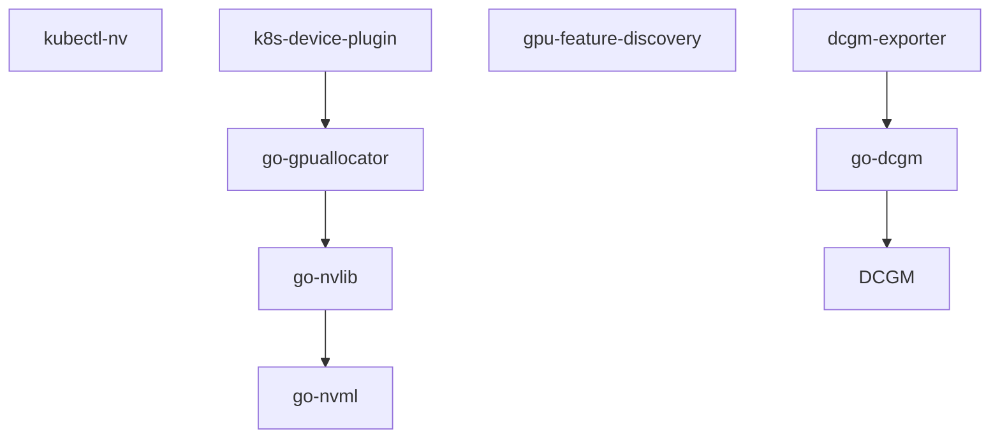
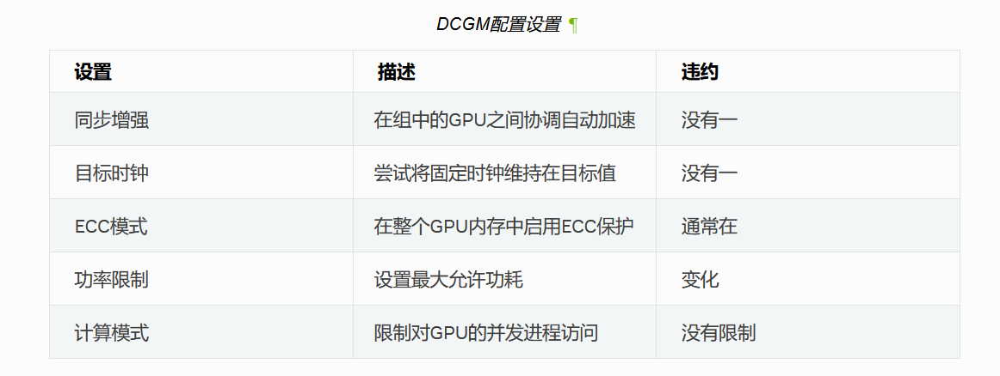
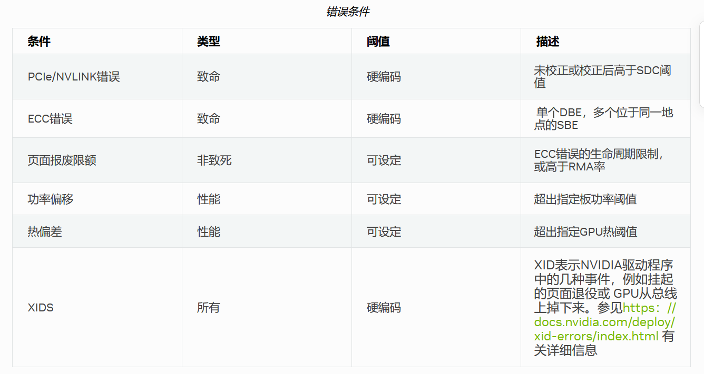
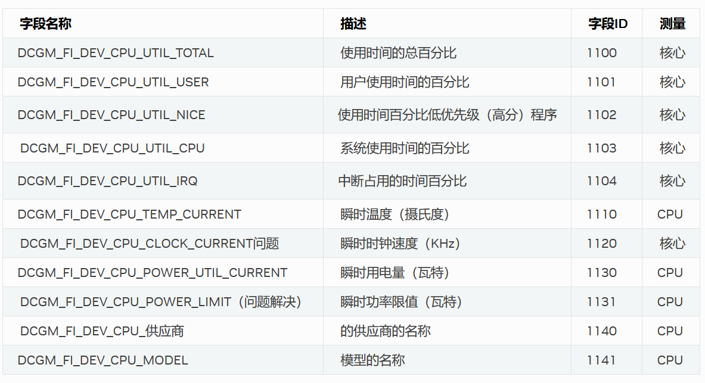

# NVIDIA调研

## NVIDIA k8s插件相关软件生态



## NVIDIA/k8s-device-plugin

用于Kubernetes的NVIDIA设备插件

| 项  | lynxi-k8s-device-plugin实现情况  |
|---|---|
|  显示集群中每个节点上的GPU数量 | 已实现  |
|  k8s>=1.10 | 未测试  |
|  支持containerd、docker | 已实现  |
|  支持cri-o | 未实现  |
|  单独yaml安装 | 未实现  |
|  helm安装 | 已实现  |
|  MIG_STRATEGY（1个gpu拆分为多个gpu使用） | 未实现  |
|  FAIL_ON_INIT_ERROR（用于在没有gpu的node上正常运行） | 未实现  |
|  NVIDIA_DRIVER_ROOT和PASS_DEVICE_SPECS（用于自定义驱动目录和支持CPUManager）| 未实现  |
| DEVICE_LIST_STRATEGY envvar、volume-mounts、cdi-annotations、cdi-cri (default 'envvar')  | 只实现了envvar  |
|  DEVICE_ID_STRATEGY uuid、index (default 'uuid') | 只实现了index  |
|  CONFIG_FILE | 未实现  |
|  可用命令行参数、环境变量、配置文件配置以上参数 | 未实现  |
|  共享访问GPU，允许多个容器使用同一个gpu | 未实现  |
|  helm在线存储库 | 未实现  |
|  通过节点标签切换配置文件 | 未实现  |
|  使用docker运行和本地运行 | 未实现  |
|  helm chart包含安装nfd，nfd是k8s官方组件 | 未实现  |

## NVIDIA/gpu-feature-discovery

用于Kubernetes的节点功能发现的GPU插件

| 项  | apu-feature-discovery实现情况  |
|---|---|
|  k8s>=1.10 | 未测试  |
|  单独yaml安装 | 未实现  |
|  helm安装 | 已实现  |
| nvidia.com/cuda.driver.major/minor/rev  | 目前没有拆分为3个标签  |
| nvidia.com/gpu.count  | 未实现  |
| nvidia.com/gpu.machine  | 未实现  |
| nvidia.com/gpu.memory  | 未实现  |
| nvidia.com/gpu.product  | 已实现  |
| nvidia.com/gfd.timestamp  | 已实现  |
| fail-on-init-error  | 未实现  |
| oneshot  | 未实现  |
| sleep-interval  | 未实现  |
| GFD_NO_TIMESTAMP  | 未实现  |
| 通过命令行参数、环境变量、configmap配置  | 未实现  |

## NVIDIA/dcgm-exporter

导出NVIDIA DCGM的GPU指标到Prometheus

| 项  | lynxi-exporter实现情况  |
|---|---|
| 本地容器启动 | 未实现 |
| helm安装 | 已实现 |
| yaml安装 | 未实现 |
| yaml安装 | 未实现 |
| 与prometheus集成 | 已实现 |
| 与grafana集成 | 未实现 |
| TLS和基本身份验证 | 未实现 |
| 基于csv配置导出哪些指标 | 未实现 |

## NVIDIA/go-dcgm

dcgm的golang绑定

## NVIDIA/DCGM

NVIDIA®数据中心GPU管理器（DCGM）简化了NVIDIA数据中心（以前称为“Tesla”）的管理 集群和数据中心环境中的GPU。DCGM的核心是一个智能、轻量级的用户空间 在每个主机系统上执行各种功能的库/代理：

- GPU行为监控
- GPU配置管理
- GPU策略监督
- GPU运行状况和诊断
- GPU统计和进程统计
- NVSwitch配置和监控

### 功能

- 支持debian/rhel/sles/ubuntu，以及包管理器安装
- go/python/c客户端
- group子命令，按组管理gpu
- config 同步增强、目标时钟、ecc模式、功率限制、计算模式等配置



- policy 配置各种错误的处理策略



- Notifications 配置各种错误的通知回调
- Actions 配置各种错误发生后的行动，比如重置gpu
- Job Statistics 根据pid或job id的后台数据收集和分析功能

```sh
dcgmi stats --pid 1234 -v
```

```
Successfully retrieved process info for pid: 1234. Process ran on 1 GPUs.
+----------------------------------------------------------------------------+
| GPU ID: 0                                                                  |
+==================================+=========================================+
|------- Execution Stats ----------+-----------------------------------------|
| Start Time *                     | Tue Nov 3 17:36:43 2015                 |
| End Time *                       | Tue Nov 3 17:38:33 2015                 |
| Total Execution Time (sec) *     | 110.33                                  |
| No. of Conflicting Processes *   | 0                                       |
+------- Performance Stats --------+-----------------------------------------+
| Energy Consumed (Joules)         | 15758                                   |
| Power Usage (Watts)              | Avg: 150, Max: 250, Min: 100            |
| Max GPU Memory Used (bytes) *    | 213254144                               |
| SM Clock (MHz)                   | Avg: 837, Max: 875, Min: 679            |
| Memory Clock (MHz)               | Avg: 2505, Max: 2505, Min: 2505         |
| SM Utilization (%)               | Avg: 99, Max: 100, Min: 99              |
| Memory Utilization (%)           | Avg: 2, Max: 3, Min: 0                  |
| PCIe Rx Bandwidth (megabytes)    | Avg: N/A, Max: N/A, Min: N/A            |
| PCIe Tx Bandwidth (megabytes)    | Avg: N/A, Max: N/A, Min: N/A            |
+------- Event Stats --------------+-----------------------------------------+
| Single Bit ECC Errors            | 0                                       |
| Double Bit ECC Errors            | 0                                       |
| PCIe Replay Warnings             | 0                                       |
| Critical XID Errors              | 0                                       |
+------- Slowdown Stats -----------+-----------------------------------------+
| Due to - Power (%)               | 0                                       |
| - Thermal (%)                    | 0                                       |
| - Reliability (%)                | 0                                       |
| - Board Limit (%)                | 0                                       |
| - Low Utilization (%)            | 0                                       |
| - Sync Boost (%)                 | Not Supported                           |
+----------------------------------+-----------------------------------------+
(*) Represents a process statistic. Otherwise device statistic during process lifetime listed.
```

- 健康与诊断
  - DCGM提供了几种了解GPU健康状况的机制，每种机制都针对不同的需求。通过利用 通过这些接口中的每一个，客户端都可以轻松地非侵入性地确定GPU的整体健康状况，而工作负载 正在运行，并且处于活动状态-当GPU可以运行专用测试时。DCGM的一个新的主要特点是能够 运行在线硬件诊断
    - Background health checks.
      - 这些是在作业运行时发生的非侵入性监视操作，可以随时查询。 对应用程序行为或性能没有影响。
    - Prologue health checks.
      - 快速、侵入性的运行状况检查，只需几秒钟，旨在验证GPU是否在作业提交之前已准备就绪。
    - Epilogue health checks.
      - 中等持续时间的侵入式运行状况检查，需要几分钟时间，可在作业失败或GPU运行状况可疑时运行
    - Full system validation.
      - 长时间侵入式运行状况检查，需要数十分钟，可在系统处于活动状态时运行， 硬件问题或其他严重问题。
- Background Health Checks
  - 这种形式的健康检查基于对各种硬件和软件组件的被动后台监控。 目标是在不影响应用程序行为或性能的情况下识别关键领域的问题。可以捕获严重的问题，例如GPU无响应、固件损坏、热逃逸等。
- 主动健康检查
  - 这种形式的健康检查是侵入性的，需要对目标GPU的独占访问。通过运行真实的工作负载， DCGM通过分析结果，能够识别各种类型的常见问题。其中包括：
    - 部署和软件问题
      - NVIDIA库访问和版本控制
      - 第三方软件冲突
    - 一体化问题
      - PCIe/NVLINK总线上可纠正/不可纠正的问题
      - 拓扑限制
      - 操作系统级设备限制，cgroups检查
      - 基本电源和散热限制检查
    - 应力检查
      - 功率和热应力
      - PCIe/NVLINK吞吐量压力
      - 恒定相对系统性能
      - 最大相对系统性能
    - 硬件问题和诊断
      - GPU硬件和SRAM
      - 计算鲁棒性
      - 存储器
      - PCIe/NVLINK总线
- 拓扑
  - DCGM提供了几种机制，用于在详细设备级视图和非详细 组级视图。这些视图被设计为向用户给予关于到GPU中的其他GPU的连接性的信息。 系统以及NUMA/亲和性
- NVLink计数器
  - DCGM提供了一种检查系统中各种链路的nvlink错误计数器的方法。这使得 方便客户端捕捉异常情况，并通过nvlink监视通信的健康状况
- Field Groups
  - DCGM提供预定义的字段组，如作业统计信息、流程统计信息和运行状况 以便于使用。此外，DCGM允许用户创建自己的自定义字段组，称为字段 组用户可以在一组GPU上查看一组字段，然后检索最新值 或者组中每个GPU的字段组中每个字段的值的范围。
- LINK状态
  - 查询GPU和NVSwitch的NVLink状态
- CPU监视
  - DCGM支持NVIDIA数据中心CPU的CPU监控



- 性能分析
  - 支持以下设备级分析指标，采样间隔100ms-1000ms可配
  - 图形引擎活动
  - SM活动
  - SM Occupancy
  - Tensor Activity
  - FP64 Engine Activity
  - FP32 Engine Activity
  - FP16 Engine Activity
  - 内存带宽利用率
  - NVLink带宽
  - PCIe带宽

- [所有指标](https://docs.nvidia.com/datacenter/dcgm/latest/dcgm-api/dcgm-api-field-ids.html)

## NVIDIA/go-nvlib

这个存储库包含一个go包的集合， NVIDIA GPU管理软件。它的许多抽象都建立在 基本的go-nvml包，它提供 NVIDIA官方管理库的全面包装

## NVIDIA/go-nvml

NVIDIA管理库（NVML）的Go绑定

## NVIDIA/go-gpuallocator

包提供了一个通用的抽象，用于执行GPU分配

## NVIDIA/kubectl-nv

Kubectl NV插件，用于管理kubernetes集群上的NVIDIA对象的工具。 kubectl-plugin基于https：//kubernetes.io/docs/tasks/extend-kubectl/kubectl-plugins/，这意味着，一旦安装到用户的$PATH中，它将成为kubectl命令行的一部分。就像“kubectl”一样。

## NVIDIA/k8s-dra-driver

Kubernetes中NVIDIA GPU的动态资源分配（Dynamic Resource Allocation，简称DRA）

### 背景知识

K8S下一代设备管理机制：DRA

deviceplugin的缺陷：

- 设备初始化：当启动一些使用FPGA的应用时，在启动应用之前，需要重新配置FPGA或者重新编程FPGA。
- 设备清理：当应用运行完成时，需要清理这个应用在设备上的配置，数据等信息。例如，FPGA需要重置。目前的Device plugin机制并没有包含清理操作的接口。
- 部分分配：某些场景下，允许一个pod中某个容器使用某个设备的部分资源，并且该pod的其他容器可以使用这个设备的剩余资源。例如：新一代GPU支持MIG模式，允许将一张GPU卡划分为更小的GPU（称为GPU实例，MIG）。在一张GPU卡上划分MIG设备是一个动态过程，当有某个pod使用MIG时，应该先为其划分出一个MIG实例，当该pod运行完成后，需要销毁这个MIG实例。
- 可选分配：部署工作负载时，用户希望指定软（可选）设备要求，如果设备存在并且可分配，那么执行分配操作。如果设备不存在，那么将回退到没有设备的节点上运行。GPU和加密引擎就是此类例子。如果一个节点有GPU设备，那么使用GPU设备运行；如果GPU没有，那么回退到使用CPU来运行同一任务。
- 带有拓扑性质的设备分配：某些设备分配时，需要考虑拓扑性质，比如RDMA和GPU。

针对Device Plugin机制的不足，K8s社区提出Dynamic Resource Allocation机制。

Kubernetes从v1.26开始引入DRA机制，DRA（Dynamic Resource Allocation，动态资源分配）是对现有Device Plugin机制的补充，并不是要替代Device Plugin机制，相比于Device Plugin，它有如下优点：

- 更加的灵活：
  - Pod申请资源时，支持填写任意参数，目前device plugin机制中申请资源只能通过在resource.limits填写资源请求量，其他参数不支持。
  - 自定义资源的设置和清理操作。
  - 用于描述资源请求的友好的API。
  - 运行管理资源的组件自主开发和部署，而无需编译Kubernetes核心组件。
  - 足够丰富的语义，使得当前所有的设备插件都可以基于DRA来实现。

相比于Device Plugin机制，DRA有如下的缺点：

- DRA调度效率要比Device Plugin低得多。
- 对于用户而言，DRA资源申请的方式比Device Plugin复杂得多。

## NVIDIA/vgpu-device-manager

它允许管理员以声明方式定义一组可能的vGPU设备 他们希望应用于节点上的所有GPU的配置。在运行时，它们 然后在其中一个配置上点nvidia-vgpu-dm， nvidia-vgpu-dm负责应用它。以这种方式，相同的 配置文件可以分布在集群中的所有节点上，运行时 标志（或环境变量）可以用来决定 在任何给定时间实际应用于节点的配置。

## NVIDIA/kubevirt-gpu-device-plugin

这是一个kubernetes设备插件，可以发现和暴露kubernetes节点上的GPU和vGPU。此设备插件将允许在您的kubernetes集群中启动GPU连接的KubevirtVM。它专门为在Kubernetes集群中服务Kubevirt工作负载而开发。

## NVIDIA/k8s-kata-manager

k8s-kata-manager项目提供了在Kubernetes上使用OCI容器运行时配置Kata运行时类的工具。

它允许管理员声明性地定义他们希望在集群中使用的运行时类。 运行在工作节点上的k8s-kata-manager将下载与每个运行时类关联的构件， 运行时类添加到容器运行时配置中，并重新启动运行时。

## NVIDIA/k8s-cc-manager

NVIDIA CC Manager是一个Kubernetes组件，可在支持的NVIDIA GPU上启用所需的CC模式。
