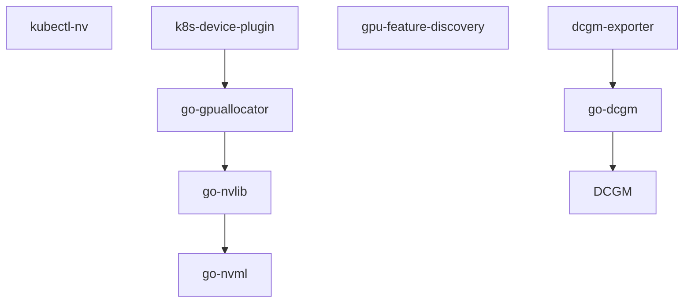

# 1. NVIDIA调研

- [1. NVIDIA调研](#1-nvidia调研)
  - [1.1. NVIDIA k8s插件相关软件生态](#11-nvidia-k8s插件相关软件生态)
  - [1.2. NVIDIA/k8s-device-plugin](#12-nvidiak8s-device-plugin)
  - [1.3. NVIDIA/gpu-feature-discovery](#13-nvidiagpu-feature-discovery)
  - [1.4. NVIDIA/dcgm-exporter](#14-nvidiadcgm-exporter)
  - [1.5. NVIDIA/go-dcgm](#15-nvidiago-dcgm)
  - [1.6. NVIDIA/DCGM](#16-nvidiadcgm)
    - [1.6.1. 功能](#161-功能)
      - [1.6.1.1. 使用方式](#1611-使用方式)
      - [1.6.1.2. GPU组](#1612-gpu组)
      - [1.6.1.3. GPU配置](#1613-gpu配置)
      - [1.6.1.4. gp监督策略](#1614-gp监督策略)
      - [1.6.1.5. 数据统计](#1615-数据统计)
        - [1.6.1.5.1. gpu数据统计](#16151-gpu数据统计)
        - [1.6.1.5.2. 字段组](#16152-字段组)
        - [1.6.1.5.3. CPU数据](#16153-cpu数据)
        - [1.6.1.5.4. 性能分析数据](#16154-性能分析数据)
        - [1.6.1.5.5. 拓扑数据](#16155-拓扑数据)
        - [1.6.1.5.6. NVLink错误数据](#16156-nvlink错误数据)
        - [1.6.1.5.7. LINK状态数据](#16157-link状态数据)
      - [1.6.1.6. 健康与诊断](#1616-健康与诊断)
    - [1.6.2. API文档](#162-api文档)
  - [1.7. NVIDIA/go-nvlib](#17-nvidiago-nvlib)
  - [1.8. NVIDIA/go-nvml](#18-nvidiago-nvml)
  - [1.9. NVIDIA/go-gpuallocator](#19-nvidiago-gpuallocator)
  - [1.10. NVIDIA/kubectl-nv](#110-nvidiakubectl-nv)
  - [1.11. NVIDIA/k8s-dra-driver](#111-nvidiak8s-dra-driver)
    - [1.11.1. 背景知识](#1111-背景知识)
  - [1.12. NVIDIA/vgpu-device-manager](#112-nvidiavgpu-device-manager)
  - [1.13. NVIDIA/kubevirt-gpu-device-plugin](#113-nvidiakubevirt-gpu-device-plugin)
  - [1.14. NVIDIA/k8s-kata-manager](#114-nvidiak8s-kata-manager)
  - [1.15. NVIDIA/k8s-cc-manager](#115-nvidiak8s-cc-manager)

## 1.1. NVIDIA k8s插件相关软件生态



## 1.2. NVIDIA/k8s-device-plugin

用于Kubernetes的NVIDIA设备插件

| 项  | lynxi-k8s-device-plugin实现情况  |
|---|---|
|  显示集群中每个节点上的GPU数量 | 已实现  |
|  k8s>=1.10 | 未测试  |
|  支持containerd、docker | 已实现  |
|  支持cri-o | 未实现  |
|  单独yaml安装 | 未实现  |
|  helm安装 | 已实现  |
|  MIG_STRATEGY（1个gpu拆分为多个gpu使用） | 未实现  |
|  FAIL_ON_INIT_ERROR（初始化失败时是否退出进程，设置未false用于在没有gpu的node运行） | 未实现  |
|  NVIDIA_DRIVER_ROOT（用于自定义驱动目录）| 未实现  |
|  PASS_DEVICE_SPECS（用于支持CPUManager更新容器时重新绑定设备）| 通过LynContainer实现  |
| DEVICE_LIST_STRATEGY(绑定gpu到容器的方式，envvar、volume-mounts、cdi-annotations、cdi-cri)  | 只实现了envvar |
|  DEVICE_ID_STRATEGY(device id的生成方式，uuid、index) | 只实现了index  |
|  CONFIG_FILE（配置文件路径） | 未实现  |
|  可用命令行参数、环境变量、配置文件配置以上参数 | 未实现  |
|  共享访问GPU，允许多个容器使用同一个gpu | 未实现  |
|  helm在线存储库 | 未实现  |
|  通过节点标签切换配置文件 | 未实现  |
|  使用docker运行和本地运行 | 未实现  |
|  helm chart包含安装nfd，nfd是k8s官方组件 | 未实现  |

## 1.3. NVIDIA/gpu-feature-discovery

用于Kubernetes的节点功能发现的GPU插件

| 项  | apu-feature-discovery实现情况  |
|---|---|
|  k8s>=1.10 | 未测试  |
|  单独yaml安装 | 未实现  |
|  helm安装 | 已实现  |
| nvidia.com/cuda.driver.major/minor/rev 驱动版本标签  | 目前没有拆分为3个标签  |
| nvidia.com/gpu.count gpu数量标签  | 未实现  |
| nvidia.com/gpu.machine gpu服务器信号标签 | 未实现  |
| nvidia.com/gpu.memory gpu内存大小标签 | 未实现  |
| nvidia.com/gpu.product gpu产品信号标签 | 已实现  |
| nvidia.com/gfd.timestamp 标签更新时间 | 已实现  |
| fail-on-init-error （初始化失败时是否退出进程，设置未false用于在没有gpu的node运行）| 未实现  |
| oneshot 只运行一次 | 未实现  |
| sleep-interval 每次更新后的睡眠时间 | 未实现  |
| GFD_NO_TIMESTAMP 没有nvidia.com/gfd.timestamp标签 | 未实现  |
| 通过命令行参数、环境变量、configmap配置  | 未实现  |

## 1.4. NVIDIA/dcgm-exporter

导出NVIDIA DCGM的GPU指标到Prometheus

| 项  | lynxi-exporter实现情况  |
|---|---|
| 本地容器启动 | 未实现 |
| helm安装 | 已实现 |
| yaml安装 | 未实现 |
| 与prometheus集成 | 已实现 |
| 与grafana集成 | 未实现 |
| 直接访问exporter的TLS和基本身份验证 | 未实现 |
| 基于csv配置导出哪些指标 | 未实现 |
| 端口配置 | 未实现 |
| 采样间隔配置 | 未实现 |
| 启用映射指标到pod | 未实现 |
| 嵌入dcgm | 未实现 |
| 配置远程dcgm | 未实现 |
| 配置哪些芯片被监控 | 未实现 |
| 通过命令行参数、环境变量、configmap配置  | 未实现  |
| 使用docker运行和本地运行 | 未实现  |

## 1.5. NVIDIA/go-dcgm

dcgm的golang绑定

## 1.6. NVIDIA/DCGM

NVIDIA®数据中心GPU管理器（DCGM）简化了NVIDIA数据中心（以前称为“Tesla”）的管理 集群和数据中心环境中的GPU。

### 1.6.1. 功能

#### 1.6.1.1. 使用方式

- 支持debian/rhel/sles/ubuntu，以及包管理器安装
- 提供go/python/c api和命令行程序

#### 1.6.1.2. GPU组

- 可以在本地节点上创建、销毁和修改GPU集合
- 几乎所有的DCGM操作都是在组上进行的

#### 1.6.1.3. GPU配置

配置调整GPU行为的参数，可配置的参数包括：

- Sync Boost:在组中的GPU之间协调自动加速
- Target Clocks:尝试将固定时钟维持在目标值
- ECC Mode:在整个GPU内存中启用ECC保护
- Power Limit:设置最大允许功耗
- Compute Mode:限制对GPU的并发进程访问

#### 1.6.1.4. gp监督策略

配置自动GPU行为以响应各种情况的方法。

错误包括：


策略包括:

- 通知策略:错误处理策略的一种时通知客户端，客户端通过dcgm api注册回调，dcgm在发生相应错误时调用回调
- 行为策略:错误发生时，自动进行的操作，比如重置GPU

#### 1.6.1.5. 数据统计

##### 1.6.1.5.1. gpu数据统计

根据pid或job id的后台数据收集和分析功能。

由dcgmi stats提供的组级数据示例：

```sh
dcgmi stats --pid 1234 -v
```

```txt
Successfully retrieved process info for pid: 1234. Process ran on 1 GPUs.
+----------------------------------------------------------------------------+
| GPU ID: 0                                                                  |
+==================================+=========================================+
|------- Execution Stats ----------+-----------------------------------------|
| Start Time *                     | Tue Nov 3 17:36:43 2015                 |
| End Time *                       | Tue Nov 3 17:38:33 2015                 |
| Total Execution Time (sec) *     | 110.33                                  |
| No. of Conflicting Processes *   | 0                                       |
+------- Performance Stats --------+-----------------------------------------+
| Energy Consumed (Joules)         | 15758                                   |
| Power Usage (Watts)              | Avg: 150, Max: 250, Min: 100            |
| Max GPU Memory Used (bytes) *    | 213254144                               |
| SM Clock (MHz)                   | Avg: 837, Max: 875, Min: 679            |
| Memory Clock (MHz)               | Avg: 2505, Max: 2505, Min: 2505         |
| SM Utilization (%)               | Avg: 99, Max: 100, Min: 99              |
| Memory Utilization (%)           | Avg: 2, Max: 3, Min: 0                  |
| PCIe Rx Bandwidth (megabytes)    | Avg: N/A, Max: N/A, Min: N/A            |
| PCIe Tx Bandwidth (megabytes)    | Avg: N/A, Max: N/A, Min: N/A            |
+------- Event Stats --------------+-----------------------------------------+
| Single Bit ECC Errors            | 0                                       |
| Double Bit ECC Errors            | 0                                       |
| PCIe Replay Warnings             | 0                                       |
| Critical XID Errors              | 0                                       |
+------- Slowdown Stats -----------+-----------------------------------------+
| Due to - Power (%)               | 0                                       |
| - Thermal (%)                    | 0                                       |
| - Reliability (%)                | 0                                       |
| - Board Limit (%)                | 0                                       |
| - Low Utilization (%)            | 0                                       |
| - Sync Boost (%)                 | Not Supported                           |
+----------------------------------+-----------------------------------------+
(*) Represents a process statistic. Otherwise device statistic during process lifetime listed.
```

##### 1.6.1.5.2. 字段组

- 预定义的字段组，如job的统计信息、进程统计信息和运行状况。
- 自定义字段组，用户可以在一组GPU上查看一组字段，然后检索最新值或者组中每个GPU的字段组中每个字段的值的范围。

##### 1.6.1.5.3. CPU数据

DCGM支持NVIDIA数据中心的CPU数据指标查询，包括cpu级别的指标和cpu core级别指标


##### 1.6.1.5.4. 性能分析数据

- 支持以下设备级分析指标，采样间隔100ms-1000ms可配
  - 图形引擎活动
  - SM活动
  - SM Occupancy
  - Tensor Activity
  - FP64 Engine Activity
  - FP32 Engine Activity
  - FP16 Engine Activity
  - 内存带宽利用率
  - NVLink带宽
  - PCIe带宽

##### 1.6.1.5.5. 拓扑数据

DCGM提供了几种机制，用于展示详细设备级视图和非详细组级视图。这些视图被设计为向用户给予关于到GPU中的其他GPU的连接性的信息。系统以及NUMA/亲和性

对于设备级视图：

```sh
dcgmi topo --gpuid 0
```

```sh
+-------------------+--------------------------------------------------------+
| GPU ID: 0         | Topology Information                                   |
+===================+========================================================+
| CPU Core Affinity | 0 - 11                                                 |
+-------------------+--------------------------------------------------------+
| To GPU 1          | Connected via an on-board PCIe switch                  |
| To GPU 2          | Connected via a PCIe host bridge                       |
+-------------------+--------------------------------------------------------+
```

对于组级视图：

```sh
dcgmi topo -g 1
```

```sh
+-------------------+--------------------------------------------------------+
| MyGroup           | Topology Information                                   |
+===================+========================================================+
| CPU Core Affinity | 0 - 11                                                 |
+-------------------+--------------------------------------------------------+
| NUMA Optimal      | True                                                   |
+-------------------+--------------------------------------------------------+
| Worst Path        | Connected via a PCIe host bridge                       |
+-------------------+--------------------------------------------------------+
.........
```

##### 1.6.1.5.6. NVLink错误数据

DCGM提供了一种检查系统中各种链路的nvlink错误计数器的方法。这方便客户端捕捉异常情况，并通过nvlink监视通信的健康状况，错误类型包括：

- CRC FLIT错误：数据链路接收流控制数字CRC错误
- CRC数据错误：数据链路接收数据CRC错误
- 重放错误：传输重放错误
- 恢复错误：传输恢复错误

##### 1.6.1.5.7. LINK状态数据

查询GPU和NVSwitch的NVLink状态

#### 1.6.1.6. 健康与诊断

DCGM提供了几种了解GPU健康状况的机制，每种机制都针对不同的需求。这些机制中的每一个，客户端都可以轻松地非侵入性地确定GPU的整体健康状况，包括：

- Background health checks.
  - 在任务运行时发生的非侵入性监视操作，可以随时查询。 对应用程序行为或性能没有影响。
- Prologue health checks.
  - 快速、侵入性的运行状况检查，只需几秒钟，旨在验证GPU是否在准备好运行任务，用在任务运行之前。
- Epilogue health checks.
  - 中等持续时间的侵入式运行状况检查，需要几分钟时间，可在作业失败或GPU运行状况可疑时运行
- Full system validation.
  - 长时间侵入式运行状况检查，需要数十分钟，可在系统处于活动状态时出现硬件问题或其他严重问题时运行。

能够捕获的问题：

- Background Health Checks
  - 可以捕获严重的问题，例如GPU无响应、固件损坏、热逃逸等。
- 其它三种主动健康检查
  - 部署和软件问题
    - NVIDIA库访问和版本控制
    - 第三方软件冲突
  - 一体化问题
    - PCIe/NVLINK总线上可纠正/不可纠正的问题
    - 拓扑限制
    - 操作系统级设备限制，cgroups检查
    - 基本电源和散热限制检查
  - 应力检查
    - 功率和热应力
    - PCIe/NVLINK吞吐量压力
    - 恒定相对系统性能
    - 最大相对系统性能
  - 硬件问题和诊断
    - GPU硬件和SRAM
    - 计算鲁棒性
    - 存储器
    - PCIe/NVLINK总线

### 1.6.2. API文档

- [所有指标](https://docs.nvidia.com/datacenter/dcgm/latest/dcgm-api/dcgm-api-field-ids.html)

## 1.7. NVIDIA/go-nvlib

这个存储库包含一个go包的集合， NVIDIA GPU管理软件。它的许多抽象都建立在 基本的go-nvml包，它提供 NVIDIA官方管理库的全面包装

## 1.8. NVIDIA/go-nvml

NVIDIA管理库（NVML）的Go绑定

## 1.9. NVIDIA/go-gpuallocator

包提供了一个通用的抽象，用于执行GPU分配

## 1.10. NVIDIA/kubectl-nv

Kubectl NV插件，用于管理kubernetes集群上的NVIDIA对象的工具。 kubectl-plugin基于https：//kubernetes.io/docs/tasks/extend-kubectl/kubectl-plugins/，这意味着，一旦安装到用户的$PATH中，它将成为kubectl命令行的一部分。就像“kubectl”一样。

## 1.11. NVIDIA/k8s-dra-driver

Kubernetes中NVIDIA GPU的动态资源分配（Dynamic Resource Allocation，简称DRA）

### 1.11.1. 背景知识

K8S下一代设备管理机制：DRA

deviceplugin的缺陷：

- 设备初始化：当启动一些使用FPGA的应用时，在启动应用之前，需要重新配置FPGA或者重新编程FPGA。
- 设备清理：当应用运行完成时，需要清理这个应用在设备上的配置，数据等信息。例如，FPGA需要重置。目前的Device plugin机制并没有包含清理操作的接口。
- 部分分配：某些场景下，允许一个pod中某个容器使用某个设备的部分资源，并且该pod的其他容器可以使用这个设备的剩余资源。例如：新一代GPU支持MIG模式，允许将一张GPU卡划分为更小的GPU（称为GPU实例，MIG）。在一张GPU卡上划分MIG设备是一个动态过程，当有某个pod使用MIG时，应该先为其划分出一个MIG实例，当该pod运行完成后，需要销毁这个MIG实例。
- 可选分配：部署工作负载时，用户希望指定软（可选）设备要求，如果设备存在并且可分配，那么执行分配操作。如果设备不存在，那么将回退到没有设备的节点上运行。GPU和加密引擎就是此类例子。如果一个节点有GPU设备，那么使用GPU设备运行；如果GPU没有，那么回退到使用CPU来运行同一任务。
- 带有拓扑性质的设备分配：某些设备分配时，需要考虑拓扑性质，比如RDMA和GPU。

针对Device Plugin机制的不足，K8s社区提出Dynamic Resource Allocation机制。

Kubernetes从v1.26开始引入DRA机制，DRA（Dynamic Resource Allocation，动态资源分配）是对现有Device Plugin机制的补充，并不是要替代Device Plugin机制，相比于Device Plugin，它有如下优点：

- 更加的灵活：
  - Pod申请资源时，支持填写任意参数，目前device plugin机制中申请资源只能通过在resource.limits填写资源请求量，其他参数不支持。
  - 自定义资源的设置和清理操作。
  - 用于描述资源请求的友好的API。
  - 运行管理资源的组件自主开发和部署，而无需编译Kubernetes核心组件。
  - 足够丰富的语义，使得当前所有的设备插件都可以基于DRA来实现。

相比于Device Plugin机制，DRA有如下的缺点：

- DRA调度效率要比Device Plugin低得多。
- 对于用户而言，DRA资源申请的方式比Device Plugin复杂得多。

## 1.12. NVIDIA/vgpu-device-manager

它允许管理员以声明方式定义一组可能的vGPU设备 他们希望应用于节点上的所有GPU的配置。在运行时，它们 然后在其中一个配置上点nvidia-vgpu-dm， nvidia-vgpu-dm负责应用它。以这种方式，相同的 配置文件可以分布在集群中的所有节点上，运行时 标志（或环境变量）可以用来决定 在任何给定时间实际应用于节点的配置。

- 功能
  - 通过configmap创建、删除一个或多个配置文件
  - 通过节点标签指定使用哪个配置文件
  - 根据配置文件配置vgpu

## 1.13. NVIDIA/kubevirt-gpu-device-plugin

这是一个kubernetes设备插件，可以发现和暴露kubernetes节点上的GPU和vGPU。此设备插件将允许在您的kubernetes集群中启动GPU连接的KubevirtVM。它专门为在Kubernetes集群中服务Kubevirt工作负载而开发。

- 功能
  - 实现kubevirt的device plugin接口
  - 发现绑定到VFIO-PCI驱动程序的Nvidia GPU，并将其作为可在直通模式下连接到VM的设备
  - 发现在kubernetes节点上配置的Nvidia vGPU，并将其公开以连接到Kubevirt VM
  - 在Kubernetes节点上通过VFIO-PCI驱动程序对GPU执行基本的健康检查

## 1.14. NVIDIA/k8s-kata-manager

k8s-kata-manager项目提供了在Kubernetes上使用OCI容器运行时配置Kata运行时类的工具。

它允许管理员声明性地定义他们希望在集群中使用的运行时类。 运行在工作节点上的k8s-kata-manager将下载与每个运行时类关联的构件， 运行时类添加到容器运行时配置中，并重新启动运行时。

- 功能
  - 安装kata container运行时并配置到k8s
  - 支持gpu直通
  - 支持vgpu

## 1.15. NVIDIA/k8s-cc-manager

NVIDIA CC Manager是一个Kubernetes组件，可在支持的NVIDIA GPU上启用所需的CC模式。
