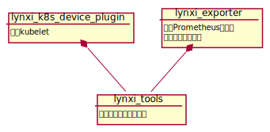
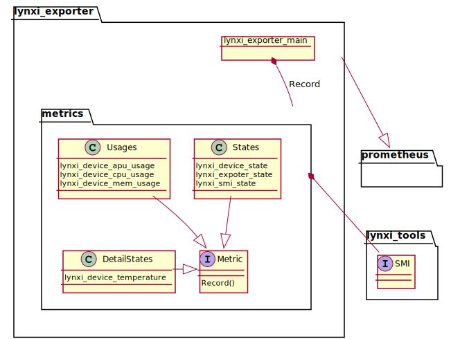
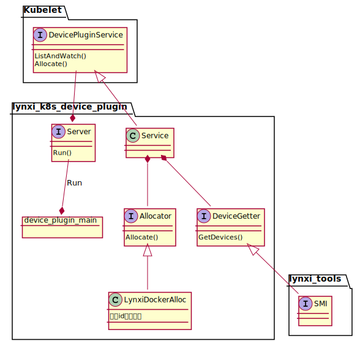
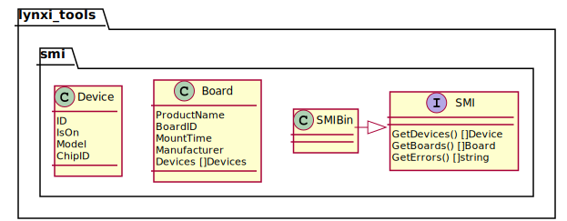

# 1. lynxi-k8s-device-plugin

实现lynxi设备在k8s的注册.

- [1. lynxi-k8s-device-plugin](#1-lynxi-k8s-device-plugin)
  - [1.1. 使用方法](#11-使用方法)
    - [1.1.1. 安装device-plugin](#111-安装device-plugin)
      - [1.1.1.1. 前置条件](#1111-前置条件)
      - [1.1.1.2. 通过kubectl部署device plugin到k8s](#1112-通过kubectl部署device-plugin到k8s)
      - [1.1.1.3. 其它部署device plugin到k8s的方式](#1113-其它部署device-plugin到k8s的方式)
    - [1.1.2. 查看使用lynxi设备的示例程序](#112-查看使用lynxi设备的示例程序)
  - [1.2. 生成代码文档](#12-生成代码文档)
  - [1.3. 关系图](#13-关系图)
    - [1.3.1. 项目关系](#131-项目关系)
    - [1.3.2. 设备状态查询项目](#132-设备状态查询项目)
    - [1.3.3. 设备插件项目](#133-设备插件项目)
    - [1.3.4. 底层接口封装项目](#134-底层接口封装项目)
  
## 1.1. 使用方法

### 1.1.1. 安装device-plugin

#### 1.1.1.1. 前置条件

1. 存在装有lynxi设备的计算机，并接入k8s集群作为k8s节点
2. 在该节点上安装LynDriver、lynxi-docker
3. 为该节点增加标签`lynxi.com: apu`

#### 1.1.1.2. 通过kubectl部署device plugin到k8s

需要一个能够通过kubectl连接k8s集群并具有创建应用权限的环境。

``` sh
kubectl apply -f DaemonSet.yml
```

#### 1.1.1.3. 其它部署device plugin到k8s的方式

任何能够通过yml和yaml文件创建应用到k8s集群的平台都可以直接使用DaemonSet.yml部署device plugin到k8s。

### 1.1.2. 查看使用lynxi设备的示例程序

[examples](examples/readme.md)

## 1.2. 生成代码文档

```shell
sudo apt install wget
go get golang.org/x/tools/cmd/godoc
go get github.com/CJH9004/godocdown
make docs
```

## 1.3. 关系图

### 1.3.1. 项目关系



### 1.3.2. 设备状态查询项目



### 1.3.3. 设备插件项目



### 1.3.4. 底层接口封装项目


